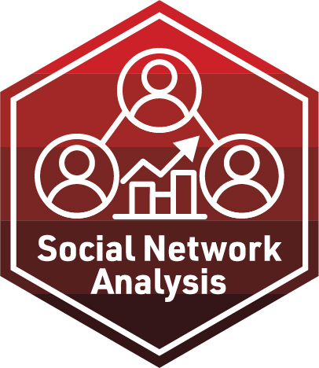

{width="300"}

# Social Network Analysis in STEM Education Research

Although social network analysis (SNA) and its educational antecedents date back to the early 1900s, the popularity of social networking sites like Twitter and Facebook have raised awareness of, and renewed interests in, social networks and their influence. As the use of digital resources continues to expand in education, data collected by these educational technologies has also greatly facilitated the application of network analysis to teaching and learning. As summarized in this [Introductory Presentation](https://laser-institute.github.io/network-analysis/sna-intro/sna-overview-slides.html), the SNA learning labs are designed to prepare STEM education researchers and practitioners to apply network analysis in order to better understand and improve student learning and the contexts in which learning occurs. The presentations, readings, and case studies for each lab will provide scholars with an overview of social network theory, examples of network analysis in STEM educational contexts, and applied experience with widely adopted tools and techniques.

**SNA Learning Lab 1: Network Analysis for Newbies** as summarized in our [Overview Presentation](https://laser-institute.github.io/network-analysis/lab-1/sna-lab-1-slides.html#1) is a gentle introduction to data collection, management and visualization. The focus of our [Essential Readings](https://laser-institute.github.io/network-analysis/lab-1/sna-lab-1-readings.html) and case study in this lab is to help LASER Scholars gain a general understanding of key SNA concepts and terminology, as well as develop a basic comfort level with representing networks visually. Our [SNA Case Study: Who's Friends with Who in Middle School](https://laser-institute.github.io/network-analysis/lab-1/sna-lab-1-case-study-key.html) is guided by the work of [Pittinsky and Carolan (2008)](https://link.springer.com/article/10.1007/s11218-007-9046-7) and compares teacher perceptions and student reports of classroom middle school friendship and helps reinforce the importance of treating behavioral and cognitive classroom friendship networks and ties as distinct. Finally, the [Intro to SNA Badge](https://laser-institute.github.io/network-analysis/lab-1/sna-lab-1-badge.html) provides an opportunity create your own data product and to reflect on how theses concepts and techniques might apply to your own research.

**SNA Learning Lab 2: Network Management & Measurement** as summarized in our [Overview Presentation](https://laser-institute.github.io/network-analysis/lab-2/sna-lab-2-slides.html#1) moves beyond basic concepts of network analysis and takes a closer look at the collection, management, and measurement of network data. Our [Essential Readings](https://github.com/laser-institute/essential-readings/tree/main/sna-labs/sna-lab-2) examine the different levels at which social networks can be analyzed, as well as common network measures for describing properties of complete networks. Our [SNA Case Study: A Tale of Two MOOCs](https://laser-institute.github.io/network-analysis/lab-2/sna-lab-2-case-study-key.html) compares discussion networks from two courses using an open educational dataset prepared by [Kellogg and Edelman (2015)](https://bera-journals.onlinelibrary.wiley.com/doi/full/10.1111/bjet.12312) as part of the Friday Institute's work around Massively Open Online Courses for Educators (MOOC-Eds). Finally, the [Measurement Badge](https://laser-institute.github.io/network-analysis/lab-2/sna-lab-2-badge.html) provides an opportunity create your own data product and to reflect on how theses concepts and techniques might apply to your own research.

**SNA Learning Lab 3: Groups, Positions, & Egocentric Analysis** as summarized in our [Overview Presentation](https://laser-institute.github.io/network-analysis/lab-3/sna-lab-3-slides.html#1) shifts the focus from complete network analysis and zooms in on methods and measures for analyzing groups, positions, and individual actors. Our [Essential Readings](https://github.com/laser-institute/essential-readings/tree/main/sna-labs/sna-lab-3) and case study explore both "top-down" and "bottom-up" approaches to identify a network's groups and extend measures introduced in the previous lab to identify individuals central to the network. Our [SNA Case Study: Components, Cliques, & Key Actors](https://laser-institute.github.io/network-analysis/lab-3/sna-lab-3-case-study-key.html) is inspired by the work of Supovitz et al. who examined groups and key actors that emerged during the intense Twitter debate surrounding the Common Core State Standards. You can learn more about their work on the expansive and interactive website for the [#COMMONCORE Project](https://www.hashtagcommoncore.com/). Finally, the [Groups & Egos Badge](https://laser-institute.github.io/network-analysis/lab-3/sna-lab-3-badge.html) provides an opportunity create your own data product and to reflect on how theses concepts and techniques might apply to your own research.

**SNA Learning Lab 4: Statistical Inference & Network Models** as summarized in our [Overview Presentation](https://laser-institute.github.io/network-analysis/lab-4/sna-lab-4-slides.html#1) wraps up our work with SNA and examines recent advances in inferential statistics that can be used to make predictions from social network data and test hypotheses we have about a network of interest. Through our [essential readings](https://github.com/laser-institute/essential-readings/tree/main/sna-labs/sna-lab-4), we'll learn about different techniques that make use of simulations to model network data and how these statistical models are used to address questions that more completely reflect the complexity of educational settings. For example, our [SNA Case Study: Birds of a Feather Lead Together](https://laser-institute.github.io/network-analysis/lab-4/sna-lab-4-case-study-key.html) is inspired by the work of [Daly and Finnigan (2016)](https://journals.sagepub.com/doi/full/10.3102/0002831210368990) makes use of Exponential Random Graph Models (ERGMs) to examine social processes (e.g. reciprocity and homophily) that might explain how school and district-level leaders select peers for collaboration or confidential exchanges. Finally, the [Models & Inference Badge](https://laser-institute.github.io/network-analysis/lab-4/sna-lab-4-badge.html) provides an opportunity create your own data product and to reflect on how theses concepts and techniques might apply to your own research.
